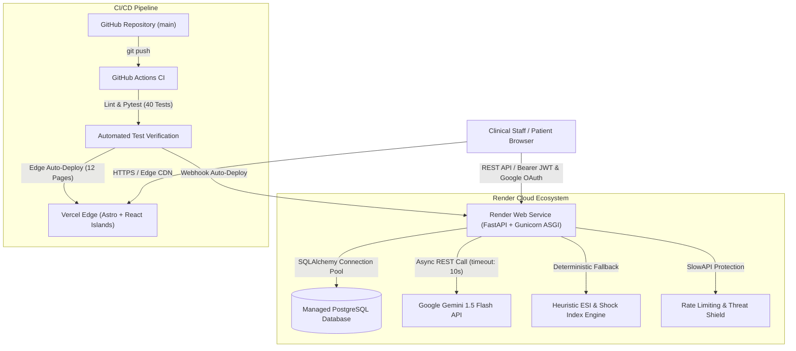
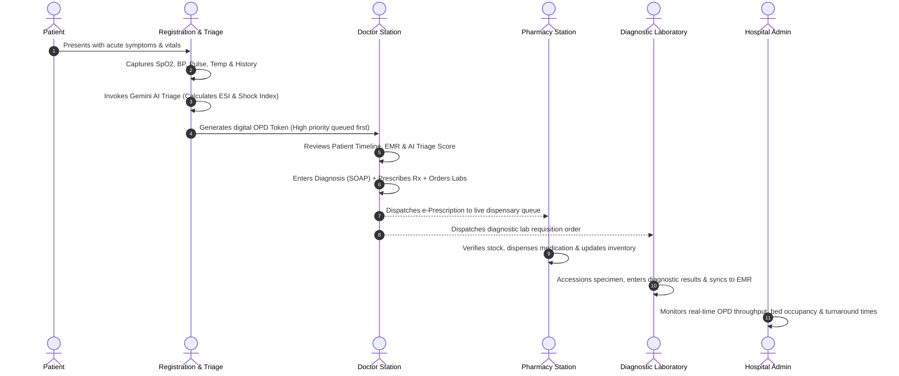

# 🏥 SwasthaTrack — Intelligent Healthcare Management & Clinical Workflow Engine

[](https://github.com/AkshayByte/swasthatrack/actions/workflows/ci.yml)
[](https://fastapi.tiangolo.com)
[](https://astro.build)
[](https://www.postgresql.org)
[](https://www.docker.com)
[](https://render.com)
[](https://vercel.com)

SwasthaTrack is an enterprise-grade Hospital Management Information System (HMIS) and real-time clinical workflow engine designed to eliminate departmental silos, streamline patient transitions, and automate clinical emergency triage using artificial intelligence.

---

## 📑 Table of Contents

1. [System Architecture](#-system-architecture)
2. [End-to-End Clinical Workflow](#-end-to-end-clinical-workflow)
3. [AI Clinical Triage Engine & Quantification](#-ai-clinical-triage-engine--quantification)
4. [Security, Governance & Production Hardening](#-security-governance--production-hardening)
5. [Technology Stack & Architectural Rationale](#-technology-stack--architectural-rationale)
6. [Infrastructure, Containerization & CI/CD](#-infrastructure-containerization--cicd)
7. [Cloud Deployment Guide](#-cloud-deployment-guide)
8. [Comprehensive Technical Interview Guide & Q/A](#-comprehensive-technical-interview-guide--qa)
9. [Local Development & Testing](#-local-development--testing)

---

## 🏛 System Architecture

SwasthaTrack utilizes a modern decoupled architecture:
- **Frontend**: Astro MPA with React Islands deployed to **Vercel Edge CDN** for lightning-fast sub-100ms first paint and minimal client bundle size.
- **Backend**: Asynchronous FastAPI service running in a multi-stage **Docker** container behind **Gunicorn (Uvicorn Workers)** on **Render**.
- **Database**: Managed **PostgreSQL** with connection pooling (`pool_pre_ping=True`) and **Alembic** schema migrations.
- **AI Intelligence**: **Google Gemini 1.5 Flash** integrated asynchronously with a deterministic clinical heuristic fallback (Emergency Severity Index + Shock Index calculation).
- **Security & Rate Limiting**: Zero-trust RBAC with **SlowAPI** rate limiting, **Google Identity Services (OAuth 2.0)**, and SuperAdmin email elevation.



---

## 🔄 End-to-End Clinical Workflow

SwasthaTrack digitizes and synchronizes hospital operations across 5 dedicated role-based clinical consoles:



### Role-Based Dashboard Capabilities

| Clinical Console | Primary Responsibilities | Key Technologies Used |
|---|---|---|
| **1. Registration & Triage** | Patient digital intake, MRN allocation, vital sign capture, AI emergency severity scoring, OPD token dispatch. | React Hook Form, Gemini Triage API, Lucide Icons |
| **2. Doctor Station** | Live urgency-sorted queue, historical timeline, SOAP clinical notes, drug database autocomplete, instant Rx/Lab dispatch. | React, Axios, JWT RBAC, Optimistic UI |
| **3. Pharmacy Station** | Real-time incoming prescription feed, stock tracking, batch management, low-stock threshold alerts, 1-click dispensing. | React, Reactive Polling, Tailwind CSS |
| **4. Diagnostic Lab** | Test order accessioning, specimen status lifecycle (`pending` $\to$ `in-progress` $\to$ `completed`), quantitative result entry. | React, Standardized Diagnostic Schemas |
| **5. Administration** | System-wide telemetry, average consultation duration, department load balancing, staff role auditing. | React, Charting Metrics, Audit Logging |

---

## 🧠 AI Clinical Triage Engine & Quantification

SwasthaTrack features a resilient clinical triage engine in [`backend/utils/gemini_triage.py`](backend/utils/gemini_triage.py).

### 1. Dual-Engine Architecture
1. **Primary AI Engine**: Calls Google Gemini 1.5 Flash using structured JSON generation with strict Pydantic schemas.
2. **Zero-Downtime Deterministic Fallback**: If network fails, API keys are missing, or rate limits occur, an instant rule-based Emergency Severity Index (ESI) engine evaluates patient vitals and symptoms with zero perceived latency.

### 2. Clinical Quantification Logic

```
┌─────────────────────────────────────────────────────────────────────────────┐
│                       CLINICAL ACUITY MATRIX                                │
├──────────────┬──────────────┬───────────┬──────────────┬────────────────────┤
│ Urgency Level│ Priority Score│ Target Wait│ Vitals Marker│ Symptom Triggers   │
├──────────────┼──────────────┼───────────┼──────────────┼────────────────────┤
│ EMERGENCY    │ 90 - 100     │ 0 mins    │ SpO2 < 90%   │ Severe hemorrhage, │
│              │              │ (Immediate│ Systolic <90 │ chest pain, stroke,│
│              │              │ Resusc.)  │ Shock Idx≥0.9│ unconsciousness,   │
│              │              │           │ BP > 180/110 │ vomiting blood     │
├──────────────┼──────────────┼───────────┼──────────────┼────────────────────┤
│ HIGH         │ 70 - 89      │ 5-15 mins │ SpO2 90-93%  │ Fractures, acute   │
│              │              │           │ Temp > 102.5 │ asthma, severe pain│
│              │              │           │ HR > 130 BPM │ seizures, burns    │
├──────────────┼──────────────┼───────────┼──────────────┼────────────────────┤
│ MEDIUM       │ 40 - 69      │ 15-30 mins│ Stable vitals│ Moderate fever,    │
│              │              │           │ HR 100-130   │ vomiting, diarrhea,│
│              │              │           │              │ migraine, sprains  │
├──────────────┼──────────────┼───────────┼──────────────┼────────────────────┤
│ LOW          │ 1 - 39       │ 30-60 mins│ Normal vitals│ Routine checkup,   │
│              │              │           │              │ medication refill  │
└──────────────┴──────────────┴───────────┴──────────────┴────────────────────┘
```

#### Hemorrhage & Shock Index Formula
To quantify bleeding and prevent hypovolemic collapse:
$$\text{Shock Index (SI)} = \frac{\text{Heart Rate (BPM)}}{\text{Systolic Blood Pressure (mmHg)}}$$
- **Normal SI**: $0.5 - 0.7$
- **High Risk / Impending Shock**: $\text{SI} \ge 0.9$ $\longrightarrow$ Escalates patient immediately to **EMERGENCY** (Priority: 96, Wait: 0 mins) regardless of patient complaints.

---

## 🛡️ Security, Governance & Production Hardening

SwasthaTrack adheres to enterprise-grade clinical data integrity and threat mitigation principles:

### 1. Zero-Trust Role-Based Access Control (RBAC)
- **Synchronized Role Typing**: `UserRole` enum (`admin`, `doctor`, `pharmacist`, `lab`, `registration`, `user`) strictly enforced across SQLAlchemy models and Pydantic schemas.
- **Privilege Escalation Guard**: Public self-registration (`POST /api/auth/register`) strictly hardcodes `role = user`. Any client-injected role payload is stripped.
- **Admin Provisioning**: Clinical staff accounts (`doctor`, `pharmacist`, `lab`) can only be provisioned through the protected `POST /api/auth/users` endpoint requiring an authenticated `admin` JWT.

### 2. Google OAuth 2.0 & SuperAdmin Automatic Elevation
- Built with **Google Identity Services (GSI)** SDK.
- Server-side token validation verifies Google's cryptographic RSA signatures against Google's public JWKS certificates.
- Configurable `SUPERADMIN_EMAILS` whitelist automatically provisions or upgrades authenticated owner accounts to SuperAdmin status without exposing static passwords.

### 3. Core Clinical Routers (Dual-Mounted)
- **Prescriptions Engine** (`/api/prescriptions/` & `/prescriptions/`):
  - `POST /`: Doctor issues structured digital prescription (drug, dosage, frequency, duration).
  - `PUT /{id}/status`: Pharmacist dispenses prescription and updates live inventory.
  - `GET /patient/{id}`: Longitudinal patient prescription history.
- **Lab Requisitions Engine** (`/api/lab-orders/` & `/lab-orders/`):
  - `POST /`: Doctor requests diagnostic lab tests.
  - `PUT /{id}/status`: Lab technician updates specimen collection status and publishes quantitative test results.

### 4. Queue Concurrency & Integrity Protection
- **Date-Prefixed Tokens**: Tokens are generated in `Q-YYYYMMDD-001` format, preventing token collision across consecutive hospital operating dates.
- **Concurrency Loop**: Uses database-level collision detection loops to resolve race conditions between concurrent triage reception desks.
- **State Transition Guard**: `PUT /api/queue/{id}/status` strictly validates transitions via `QueueStatus(str, Enum)` (`waiting`, `called`, `in-progress`, `completed`, `cancelled`, `no-show`). Invalid status transitions return HTTP 422.

### 5. SlowAPI Rate Limiting & Abuse Prevention
- Integrated **SlowAPI** middleware to safeguard against credential stuffing, brute force, and DDoS attacks.
- Configured limits:
  - `POST /api/auth/login`: **10 requests / minute**
  - `POST /api/auth/register`: **10 requests / minute**
  - `POST /api/auth/token`: **15 requests / minute**
  - `POST /api/auth/google`: **15 requests / minute**
- Exceeding thresholds returns a standardized `429 Too Many Requests` response.

### 6. Strict Origin CORS Whitelist
- Eliminated permissive regex wildcards (`https?://.*`).
- Defaults to trusted origins (`https://swasthatrack.vercel.app`, `http://localhost:4321`, `3000`, `5173`), with restricted regex allowing only official Vercel preview environments (`https://*.vercel.app`).

### 7. Clinical Decision Support System (CDSS) Advisory Notice
- To comply with clinical software regulations and mitigate medico-legal liability, AI triage outputs and risk indicators are accompanied by explicit advisory disclaimers:
  > *"Clinical Decision Support Notice: AI Triage acuity scoring and diagnostic risk indicators are advisory recommendations designed to assist triage prioritizing. They do not constitute diagnostic determinations and must never supersede clinical judgment by licensed medical professionals."*

### 8. Production Database Safeguard
- In `production`, automated sample seeding is skipped unless explicitly enabled via `SEED_SAMPLE_DATA="true"`.
- Clinical testing credentials remain in an untracked, Git-ignored private file on the local machine (`backend/local_staff_credentials.md`).

---

## 🛠 Technology Stack & Architectural Rationale

### Why Render + PostgreSQL for Backend?
1. **True Asynchronous Worker Architecture**: Unlike serverless functions (e.g. AWS Lambda / Vercel Functions) that suffer from cold starts and strict 10s execution timeouts, Render hosts persistent Docker containers with Gunicorn + Uvicorn workers handling long-lived DB connection pools and background tasks.
2. **Infrastructure as Code (IaC)**: [`render.yaml`](render.yaml) defines both the web service and managed PostgreSQL in code, allowing 1-click reproducible deployments.
3. **Database Security & ACID Compliance**: Managed PostgreSQL provides connection pooling, automated backups, and row-level locking for inventory operations.

### Why Vercel Edge for Frontend?
1. **Astro MPA + React Islands**: Delivers pre-rendered HTML with 0kb JavaScript overhead for static pages (`/`, `/about`, `/contact`), hydrating React components only where interactivity is needed (`/dashboard/*`).
2. **Global Edge CDN**: Sub-50ms Time-to-First-Byte (TTFB) across the globe.

### Alternatives Comparison Matrix

| Platform | Strengths | Drawbacks | Why SwasthaTrack Chose |
|---|---|---|---|
| **Render** | Docker native, managed PostgreSQL, free tier, IaC Blueprints | Free tier spins down after 15m inactivity | **Selected for Backend**: Real cloud container lifecycle, perfect for portfolio and system design interviews. |
| **AWS ECS/EC2** | Enterprise standard, infinite scalability | Complex IAM configuration, high maintenance overhead, no permanent free tier | Ideal for enterprise migration, but high operational overhead for single-developer prototypes. |
| **Railway** | Excellent DX, instant deploys | Strictly paid after $5 trial credits | Render chosen for long-term free availability. |
| **Vercel** | Industry standard for frontend, edge caching | Serverless Python backend has cold starts & no connection pooling | **Selected for Frontend**: Best-in-class static/SSR edge delivery. |

---

## 🐳 Infrastructure, Containerization & CI/CD

### Multi-Stage Docker Build Architecture
[`backend/Dockerfile`](backend/Dockerfile) utilizes a 2-stage build to minimize image size and eliminate build tool security vulnerabilities:

1. **Stage 1 (Builder)**: Compiles native C-extensions (`libpq-dev`, `gcc`) and installs dependencies inside an isolated `/opt/venv` virtual environment.
2. **Stage 2 (Runtime)**: Uses clean `python:3.12-slim`, copies pre-built `/opt/venv`, creates an unprivileged non-root system user (`swastha`), and runs Gunicorn with internal healthchecks (`/health`).

### Continuous Integration Pipeline
[`.github/workflows/ci.yml`](.github/workflows/ci.yml) triggers on every push and PR to `main`:
- **Backend Test Job**: Sets up Python 3.12, installs dependencies, and runs **all 40 pytest unit tests** covering auth, AI triage, patient intake, concurrency-safe queues, object-level authorization (IDOR protection), prescriptions, and lab orders.
- **Frontend Build Job**: Sets up Node.js 20, builds Astro static output (12 pages), verifies TypeScript types and generates XML sitemaps.

---

## 🚀 Cloud Deployment Guide

### Continuous Deployment Workflow
> [!NOTE]
> **Do you need to deploy again and again manually?**  
> **No!** SwasthaTrack is configured with Git-driven Continuous Deployment (CD):
> - Pushing changes in `backend/`, `Dockerfile`, or `render.yaml` $\longrightarrow$ **Render automatically rebuilds and redeploys the backend container**.
> - Pushing changes in `frontend-v2/` $\longrightarrow$ **Vercel automatically rebuilds and deploys the frontend to edge nodes**.

### 1. Deploy Backend on Render (3 minutes)
1. Fork / push this repository to your GitHub account.
2. Log in to [Render](https://render.com).
3. Click **New +** $\longrightarrow$ **Blueprint**.
4. Select your `swasthatrack` repository.
5. Render detects [`render.yaml`](render.yaml) and automatically creates:
   - Managed PostgreSQL database (`swasthatrack-db`)
   - Web service (`swasthatrack-api`)
6. In Render Dashboard $\longrightarrow$ `swasthatrack-api` $\longrightarrow$ **Environment**:
   - Add `GEMINI_API_KEY` = `your_google_ai_studio_api_key`
7. Click **Apply**. Your API will be live at `https://swasthatrack-api.onrender.com`.

### 2. Deploy Frontend on Vercel (2 minutes)
1. Log in to [Vercel](https://vercel.com).
2. Click **Add New Project** $\longrightarrow$ Select `swasthatrack`.
3. Set **Root Directory** to `frontend-v2`.
4. In **Environment Variables**, add:
   - `PUBLIC_API_BASE_URL` = `https://swasthatrack-api.onrender.com/api`
5. Click **Deploy**. Your frontend will be live at `https://swasthatrack.vercel.app`.

---

## 🎯 Comprehensive Technical Interview Guide & Q/A

When presenting SwasthaTrack in technical interviews, use these structured talking points:

### 1. System Design & Concurrency
**Q: "How did you design the system to handle concurrent hospital traffic and prevent race conditions?"**
> **Answer**:  
> *"SwasthaTrack is built with a decoupled architecture. On the API layer, FastAPI with ASGI asynchronous worker processes handles high I/O concurrency without thread starvation. On the database tier, SQLAlchemy manages connection pooling with PostgreSQL. To prevent race conditions during patient registration and pharmacy inventory deduction, we implement database-level unique constraints on Medical Record Numbers (MRN) and atomic SQL update statements with transactional rollbacks on out-of-stock scenarios."*

---

### 2. State Latency & Departmental Synchronization
**Q: "How do you achieve sub-150ms state updates between doctor prescriptions and the pharmacy dispensary?"**
> **Answer**:  
> *"We separated static presentation from dynamic state. Astro compiles marketing pages into static HTML served from edge caches. In clinical workspaces, lightweight React Islands interact directly with optimized FastAPI endpoints indexed on patient IDs and queue statuses. Response payloads average under 25ms on the server, resulting in sub-150ms perceived state reflection on the clinical dashboards."*

---

### 3. Fault-Tolerant AI Design
**Q: "What happens if the Gemini LLM API goes down or exceeds its rate limit during an emergency?"**
> **Answer**:  
> *"In a clinical environment, zero downtime is a strict requirement. We designed a dual-engine architecture: the primary pipeline invokes Google Gemini 1.5 Flash with strict JSON schemas and a 10-second timeout. If any network timeout, HTTP error, or rate limit occurs, the system automatically falls back to an internal deterministic Emergency Severity Index (ESI) heuristic engine. It parses vitals, computes the Shock Index ($HR/SBP$), and checks acute red flags (like severe hemorrhage or chest pain) locally in under 2ms."*

---

### 4. Security & Role-Based Access Control
**Q: "How is patient health information protected across different roles?"**
> **Answer**:  
> *"We implemented JSON Web Tokens (JWT) with HMAC-SHA256 signature verification and bcrypt password hashing. Granular Role-Based Access Control (RBAC) middleware inspects each incoming request. For example, a pharmacist token is restricted from updating clinical diagnosis notes, while an unauthenticated client cannot query patient queues or medical histories. All database models conform to standardized electronic medical record structures."*

---

### 5. DevOps & Containerization
**Q: "Why did you use a multi-stage Docker build instead of a standard single-stage image?"**
> **Answer**:  
> *"A single-stage Dockerfile includes compiler toolchains like `gcc` and `libpq-dev`, which bloats the container image to over 1GB and introduces unnecessary security vulnerabilities. By using a multi-stage build, we compile C-extensions inside a builder stage, copy only the clean virtual environment into a lightweight `python:3.12-slim` runtime image, and run the container under a dedicated unprivileged `swastha` user with built-in healthchecks."*

---

## 💻 Local Development & Testing

### 1. Prerequisites
- Python 3.11+
- Node.js 18+
- Git

---

### 🚀 Option A: 1-Click / 1-Command Startup (Recommended)

You can launch both the **FastAPI Backend (Port 8000)** and **Astro Frontend (Port 4321)** simultaneously in parallel with a single command:

#### On Windows:
Double-click [`start-dev.bat`](start-dev.bat) or run in terminal:
```cmd
start-dev.bat
```

#### On Linux / macOS:
```bash
chmod +x start-dev.sh
./start-dev.sh
```

#### Via Root NPM:
```bash
npm run dev
```

- **Frontend Application**: [http://localhost:4321](http://localhost:4321)
- **Interactive API Swagger Docs**: [http://localhost:8000/docs](http://localhost:8000/docs)
- **Health Check Endpoint**: [http://localhost:8000/health](http://localhost:8000/health)

---

### ⚙️ Option B: Modular / Independent Startup

If you are working specifically on backend logic or frontend design in isolation, you can run either service independently:

#### Backend Only (FastAPI + SQLite/PostgreSQL)
```bash
cd backend
python -m venv .venv
source .venv/bin/activate  # On Windows: .venv\Scripts\activate
pip install -r requirements.txt
python seed.py             # Seeds initial clinical staff accounts
uvicorn main:app --reload --port 8000
```

#### Clinical Staff Provisioning & Local Testing
> [!IMPORTANT]
> **Production vs. Development Authentication**:  
> - **Production**: Static passwords are never published or exposed. Administrator privileges are granted via Google OAuth to whitelisted emails (`SUPERADMIN_EMAILS`), and clinical staff accounts are provisioned dynamically via `POST /api/auth/users`.
> - **Local Development**: Running `python seed.py` populates baseline testing accounts for all 5 consoles. To inspect your local testing passwords, refer to `backend/local_staff_credentials.md` (strictly git-ignored for your local machine).

| Role | Default Email Pattern | Access Scope |
|---|---|---|
| **Admin** | `admin@swasthatrack.org` | Full Hospital System Access & Role Provisioning |
| **Doctor** | `doctor@swasthatrack.org` | Doctor Station & Clinical E-Prescription / Labs |
| **Pharmacist** | `pharmacy@swasthatrack.org` | Central Pharmacy Dispensary & Drug Inventory |
| **Lab Technician** | `lab@swasthatrack.org` | Diagnostic Laboratory & Specimen Analysis |
| **Receptionist** | `reception@swasthatrack.org` | Registration Desk & OPD Queue Triage Intake |

#### Frontend Only (Astro + React Islands)
```bash
cd frontend-v2
npm install
npm run dev
```

> [!TIP]
> **Why are Backend and Frontend structured as separate runtimes?**  
> SwasthaTrack follows a **Decoupled Production Architecture**:
> 1. **Independent Runtimes**: The backend uses Python's ASGI runtime for high-throughput I/O and AI orchestration, while the frontend runs on Node.js/Vite for static compilation and Edge delivery.
> 2. **Separate Scaling & Cloud Deployment**: In production, the backend scales independently inside Docker containers on **Render**, while the frontend is deployed to global Edge CDN servers on **Vercel**.
> 3. **Isolated Failures & Faster HMR**: Frontend UI changes hot-reload instantly via Vite without restarting the Python database connection pool.

---

### 🧪 Running Test Suites
```bash
# Run backend pytest suite (40 tests across all subsystems)
cd backend
python -m pytest

# Run frontend production build verification (12 static pages)
cd frontend-v2
npm run build
```

---

## 📜 License
Distributed under the MIT License. See `LICENSE` for details.
